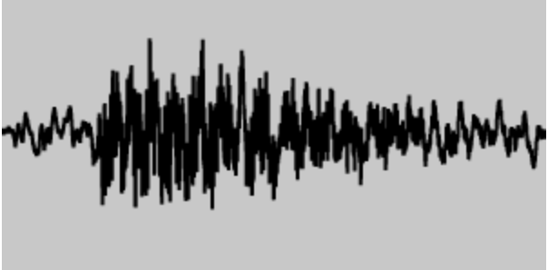
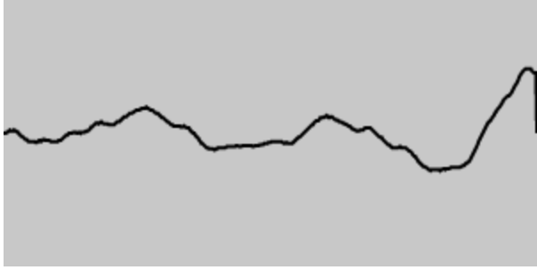

# WebAudio

> Web Audio API 提供了在 Web 上控制音频的一个非常有效通用的系统，允许开发者来自选音频源，对音频添加特效，使音频可视化，添加空间效果 （如平移），等等。

## 1. AudioContext

构造函数：可选参数`latencyHint`值有 3 个，一般使用默认值即可

-   `balanced` 平衡音频输出延迟和资源消耗
-   `inteactive` 默认值 提供最小的音频输出延迟最好没有干扰
-   `playback` 对比音频输出延迟，优先重放不被中断

```js
const ac = new AudioContext({ latencyHint: "balanced" });
```

返回`AudioContext`的实例(有个印象就行)

```js
console.log(ac);

// audioWorklet: AudioWorklet {}
// baseLatency: 0.005333333333333333
// currentTime: 1.5946666666666667
// destination: AudioDestinationNode {maxChannelCount: 2, context: AudioContext, numberOfInputs: 1, numberOfOutputs: 0, channelCount: 2, …}
// listener: AudioListener {positionX: AudioParam, positionY: AudioParam, positionZ: AudioParam, forwardX: AudioParam, forwardY: AudioParam, …}
// onstatechange: null
// sampleRate: 48000
// state: "running"
```

-   baseLatency: 返回 AudioContext 将音频从 AudioDestinationNode 传递到音频子系统的处理延迟的秒数

其他都是从父类继承的属性：

-   sampleRate: 采样率
-   currentTime: 只读，从 0 开始，只增不减，以秒为单位
-   state: 表示当前的状态
    -   suspended: 调用了`ac.suspend()`
    -   running: 正常运行
    -   closed: 调用了`ac.close()`
-   onstatechange: 状态改变事件监听

```js
audioCtx.onstatechange = function () {
    console.log(audioCtx.state);
};
```

-   audioWorklet: AudioWorklet 和 AudioWorkletNode 有关（下面解释 TODO:）
-   destination: 返回 AudioDestinationNode 对象，表示 context 的最终节点，一般是音频渲染设备
-   listener: 返回 AudioListener 对象，可以用来实现 3D 音频空间化

### 1.1 AudioNode与destination

AudioNode接口是一个处理音频的通用模块，在实际应用中我们不会直接使用AudioNode，而是使用AudioNode的子类们，AudioNode的子类很多，下面列举2个来实现一个基本的demo


节点名称|创建方式|含义
--|--|--
AudioDestinationNode|通过audioContext.destination属性获得，也是audioContext默认创建好的|表示 context 的最终节点，一般是音频渲染设备
AudioBufferSourceNode|通过audioContext.createBufferSource()创建|音源
GainNode|通过audioContext.createGain()创建|调节音量

每个AudioNode代码一个处理声音的模块（比如音量GainNode，音源AudioSourceNode），处理完成后交由下个AudioNode来处理，传递的方式由`audioNode1.connect(audioNode2)`来实现

`destination`是一个特殊的AudioNode，它代表处理完成后的声音播放的出口，也是AudioContext存在的必要，所以在创建AudioContext时已创建好了，可以直接通过`audioContext.destination`来获得

通过对上述AudioNode的理解，可以通过demo来实现最基本的功能：使用AudioContext来播放音乐

### 1.2 demo1 使用 AudioContext 播放音乐

补充一个API: `audioContext.decodeAudioData`： 将音频的ArrayBuffer解码成AudioBuffer

通过ajax或者fileReader可以读取音乐文件的rawData，然后转成ArrayBuffer，因为音乐文件都是经过编码，然后封装，decodeAudioData就可以将压缩的音乐文件解码成AudioBuffer数据（可以理解成PCM？）


TIPS: 可以在`headers`上加上`range`请求来限定播放的范围


```js
const mp3 = "http://127.0.0.1:5500/public/tornado.mp3";
const button = document.querySelector("button");

class Demo1 {
    constructor() {
        this.audioContext = new AudioContext({ latencyHint: "balanced" });
    }

    async start() {
        const musicArrayBuffer = await this.getMp3ArrayBuffer(mp3);
        const decodedAudioData = await this.decode(musicArrayBuffer);
        this.play(decodedAudioData);
    }

    /**
     * @param {AudioBuffer} decodedAudioData
     * @returns
     */
    async play(decodedAudioData) {
        const sourceNode = this.audioContext.createBufferSource();
        sourceNode.buffer = decodedAudioData;
        sourceNode.connect(this.audioContext.destination);
        sourceNode.start(0);
    }

    /**
     * @param {string} url
     * @returns {ArrayBuffer}
     */
    async getMp3ArrayBuffer(url) {
        return fetch(url).then((r) => r.arrayBuffer());
    }

    /**
     * @param {ArrayBuffer} arrayBuffer
     * @returns {AudioBuffer}
     */
    async decode(arrayBuffer) {
        return this.audioContext.decodeAudioData(arrayBuffer);
    }
}

button.onclick = () => new Demo1().start();
```

demo的流程：
```
ajax => 原始数据(ArrayBuffer) => 解码后数据(AudioBuffer) => AudioBufferSourceNode(把解码后的数据挂载到音源上) => 通过audioContext.destination交由硬件播放
```

## 2. [AudioNode](https://developer.mozilla.org/zh-CN/docs/Web/API/AudioNode)

上面简单了解了下AudioNode，其实Audio的子类非常多，这些AudioNode也是AudioContext的重中之重


### 2.1 AudioBufferSourceNode

该节点代表音源

由`audioContext.createBufferSource()`方法创建 

这个节点的用法如上面的demo，创建后需要往其`buffer`属性上挂载需要播放的数据，除此之外，还有一些其他的属性

- loop: 是否为循环播放
- loopStart/loopEnd: 如果设置了循环播放，那么就会在此区间内循环播放
- playbackRate: 播放倍速，可以通过`source.playbackRate.value = 2`的方式来修改值，同时上还有`minValue`和`maxValue`来表示调整区间

还有2个关键的方法

- play: play的参数 ([when][, offest][, duration]) 
    - when是何时被播放，如果when小于audioContext.currentTime或者是0，声音会被立即播放
    - duration播放的持续时间，如果没有设置就会播放到最后
- stop: 停止播放

事件：
- onended: 播放结束事件


### 2.2 AudioDestinationNode

该节点代表声音输出

由`audioContext.createMediaStreamDestination()`创建

由于代表声音的输出节点，所以该节点不能再使用`connect`方法去连接其他节点，否则会报 

```
Uncaught DOMException: Failed to execute 'connect' on 'AudioNode': output index (0) exceeds number of outputs (0).
```

`destinationNode`在创建`audioContext`时会自动挂载到`audioContext.destination`上，所以一般不需要创建


属性：
- maxChannelCount(read-only): 返回设备可以处理的最大通道数；


### 2.3 GainNode

该节点代表音量控制

由`audioContext.createGain()`创建

可以通过设置`gainNode.gain.value`的值来设置音量，值的范围是 `[0, 1]`

具体用法可以看下demo2

```js
function play(decodedAudioData) {
    const audioContext = new AudioContext();
    const sourceNode = audioContext.createBufferSource();
    sourceNode.buffer = decodedAudioData;
    const gainNode = audioContext.createGain();
    sourceNode.connect(gainNode);
    gainNode.connect(audioContext.destination);

    gainNode.gain.value = 0.5;
    sourceNode.start(0);
}
```

### 2.4 其他创建Source的方式 

#### 2.4.1 createMediaElementSource

接收一个`audio`或者`video`元素

#### 2.4.2 createMediaStreamSource

接收一个`MediaStream`对象

关于`MediaStream`的文档可以看[一文读懂navigator.mediaDevices API](https://juejin.cn/post/6924563220657586184)
#### 2.4.3 createConstantSource

没有参数，也没有声音

关于音源的用法可以看demo3


### 2.5 AnalyserNode

AudioContext的createAnalyser()方法能创建一个AnalyserNode，可以用来获取音频时间和频率数据（时域和频域），以及实现数据可视化，它不对音频有任何修改作用，仅仅是分析。

想要正确使用的话，需要设定一些参数

- fftSize： fft是[快速傅里叶变换](https://zh.wikipedia.org/zh-cn/%E5%BF%AB%E9%80%9F%E5%82%85%E9%87%8C%E5%8F%B6%E5%8F%98%E6%8D%A2)（回到了被高数信号支配的恐惧），fftSize就是样本的窗口大小。
    fftSize的值必须是32-32768范围内的2的非零幂（说人话就是2^5, 2^6, 2^7等等这些值），默认值是2048

下面是2张分析后的截图，分别是2048*4和512，相差16倍，所谓窗口大小，可以理解为横向的容纳范围





- frequencyBinCount(readOnly)： 其值为fftSize的一半，作用是以此为bufferLength创建一个Unit8Array的实例，然后将音频的时域或者频域的数据拷贝进去

获取时域和频域的方法分别为

- getByteTimeDomainData
- getByteFrequencyData

```js
const analyser = audioContext.createAnalyser();
analyser.fftSize = 2048;
const dataArray = new Unit8Array(analyser.frequencyBinCount);
// 将时域的数据拷贝到dataArray中
analyser.getByteTimeDomainData(dataArray);
// 可以将上术方法放到rAF中，来实时刷新dataArray
// 最后将dataArray的数据渲染即可
```

具体用法可以看demo4


## x. 附录

-   [让你的网页开口说话 —— audioContext API](https://xiaotianxia.github.io/blog/vuepress/js/useful_webapis_audiocontext.html?_=193678675665)
- [web audio api 前端音效处理](https://zenaro.github.io/blog/2017/03/01/web-audio-api/)
